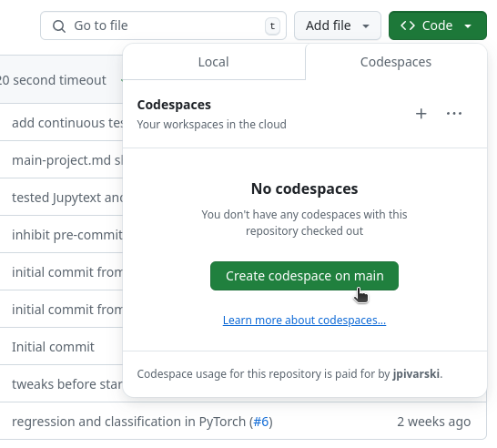

# Array oriented programming for particle physicists

This book is an introduction to analyzing particle physics data in Python using arrays.

Before you start reading, open the "notebooks" folder in Jupyter Lab, which gives you an environment in which you can run the examples and sets everything up to do the practice problems.

## In GitHub Codespaces

One way to do that is to launch a Codespace from the [hsf-training/array-oriented-programming](https://github.com/hsf-training/array-oriented-programming) repository:

{. width="60%"}

The first time your Codespace launches, it will take a few minutes to install all of the software. Once it's done, navigate to the `notebooks` directory in the left side-bar and open `lesson-1-workbook.ipynb`.

**Note:** you can't run the GPU lessons in codespaces, since it doesn't have a GPU. [Google Colab](https://colab.research.google.com/) has GPUs, but you'd have to install the software yourself.

## On your own computer

You can run everything on your own computer if you have the following software installed (this is an [environment.yml](https://github.com/hsf-training/array-oriented-programming/blob/main/environment.yml) file for [conda](https://scikit-hep.org/user/installing-conda)):

```{include} ../environment.yml
:literal: true
```

**Note:** to do [Lesson 5: Python on GPUs](5-gpu.ipynb), you'll also need an Nvidia GPU and the following packages: `cupy` and `numba`. See the lesson for hints on installing CUDA.

## Table of contents

```{tableofcontents}
```
