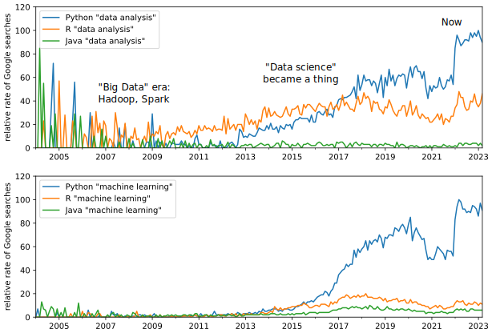
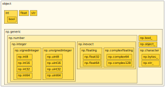
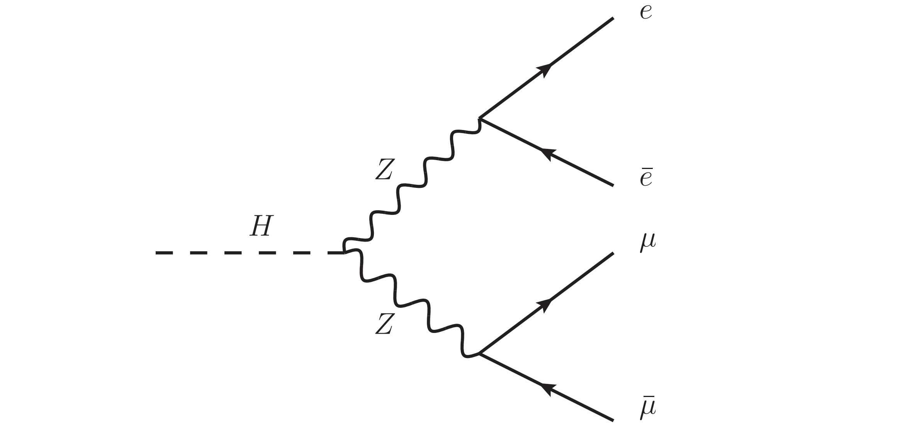

---
jupytext:
  cell_metadata_filter: -all
  formats: md:myst
  text_representation:
    extension: .md
    format_name: myst
    format_version: 0.13
    jupytext_version: 1.16.4
kernelspec:
  display_name: Python 3 (ipykernel)
  language: python
  name: python3
---

# Lesson 1: Python

+++

If you're following this course, you're probably already familiar with the Python programming language—at least a little bit. Nevertheless, I'll start with a review of the language for three reasons:

* to make sure there aren't any gaps in your knowledge,
* so that you can be confident that there isn't something extra you need to know,
* array-oriented programming emphasizes a different subset of the language, as you'll see.

On the last point, this review of Python covers `for` and `if` statements _last_, rather than _first_, and doesn't cover classes. Defining classes is an important part of Python programming, but we won't be using it.

+++

## Why Python?

+++

Python is now the most popular programming language for many applications. For our purposes, what's relevant is that it is the most popular language for data analysis. Below are plots of search volume from [Google Trends](https://trends.google.com/trends/) that show how often people search for "data analysis" and "machine learning" in the same query with "Python", "R", and "Java".

{. width="100%"}

"Popularity" means more tools are available, more attention has been drawn to their shortcomings, and you can find more information about how to use them online. It also means that Python skills are transferable skills.

+++

## Python as an interactive calculator

+++

The most important thing about Python, especially for data analysis, is that it is an interactive language. Unlike "compile-first" languages such as C++, Fortran, and Rust, you can partially run a program and type arbitrary commands into a terminal or a Jupyter notebook, while it runs.

The cost of this interactivity is speed. Python has a severe performance penalty compared to "compile-first" languages, so if you're not _using_ this interactivity (for instance, by always running whole scripts at a time), you're missing out on a feature you're paying for!

Any expression typed on the Python prompt or in a Jupyter cell computes the expression and returns the result:

```{code-cell} ipython3
2 + 2
```

You can also define variables,

```{code-cell} ipython3
E = 68.1289790
px = -17.945541
py = 13.1652603
pz = 64.3908386
```

and use them in expressions.

For instance, calculate ${p_x}^2 + {p_y}^2$.

```{code-cell} ipython3
px**2 + py**2
```

Now the transverse momentum $p_T = \sqrt{{p_x}^2 + {p_y}^2 + {p_z}^2}$.

```{code-cell} ipython3
(px**2 + py**2 + pz**2)**(1/2)
```

The examples in this introduction to Python are inspired by particle physics, so we'll be using the momentum-energy relations a lot:

$$p = \sqrt{{p_x}^2 + {p_y}^2 + {p_z}^2}$$

$$m = \sqrt{E^2 - p^2}$$

+++

**Mini-quiz 1:** Fix the mistake!

```{code-cell} ipython3
m = (E**2 - px**2 + py**2 + pz**2)**(1/2)
m
```

(The result above is wrong.)

For reference, here's a table of Python's arithmetic operators:

| operator | meaning | returns |
|:--:|:--:|:--:|
| `x + y` | addition | same type of number |
| `x - y` | subtraction | same type of number |
| `-x` | negation | same type of number |
| `x * y` | multiplication | same type of number |
| `x / y` | division | floating-point number |
| `x // y` | truncated division | integer number |
| `x % y` | modulo (remainder) | integer number |
| `x ** y` | exponentiation | same type of number |
| `x == y` | equality | boolean (`True` or `False`) |
| `x != y` | inequality | boolean (`True` or `False`) |
| `x < y` | less than | boolean (`True` or `False`) |
| `x <= y` | less than or equal to | boolean (`True` or `False`) |
| `x > y` | greater than | boolean (`True` or `False`) |
| `x >= y` | greater than or equal to | boolean (`True` or `False`) |
| `x @ y` | matrix multiplication | array |
| `~x` | bitwise not | integer number |
| `x & y` | bitwise and | integer number |
| `x \| y` | bitwise or | integer number |
| `x ^ y` | bitwise xor | integer number |

+++

## Defining functions

+++

The syntax for defining a function is:

```{code-cell} ipython3
def euclidean(x, y, z):
    return (x**2 + y**2 + z**2)**(1/2)

def minkowski(time, space):
    return (time**2 - space**2)**(1/2)
```

We can call them using arguments identified by position,

```{code-cell} ipython3
euclidean(px, py, pz)
```

or by name,

```{code-cell} ipython3
euclidean(z=pz, y=py, x=px)
```

The arguments of a function call can be the return values of other functions.

```{code-cell} ipython3
minkowski(E, euclidean(px, py, pz))
```

You can also define functions inside of functions.

```{code-cell} ipython3
def mass(E, px, py, pz):
    def euclidean(x, y, z):
        return (x**2 + y**2 + z**2)**(1 / 2)

    def minkowski(time, space):
        return (time**2 - space**2)**(1 / 2)

    return minkowski(E, euclidean(px, py, pz))

mass(E, px, py, pz)
```

Note that the nesting is indicated by indenting, rather than curly brackets (`{` `}`), an `end` token, or any other syntax. The rules are:

* the first statement must have no whitespace (no tabs or spaces),
* nesting is opened by increasing the whitespace relative to the previous line,
* nesting is closed by decreasing the whitespace to a previously established level.

"Whitespace" can be tabs or spaces, but since both are invisible, it can be easy to confuse them. Most codebases use a standard of 4 spaces (and never use tabs), which is what we'll do here.

+++

## Functions are objects

+++

The functions that we defined above are objects that can be referred to by variables, just like numbers.

```{code-cell} ipython3
mag3d = euclidean
```

Now `mag3d` can be used in exactly the same ways as `euclidean`, because they're just two names for the same thing.

```{code-cell} ipython3
mag3d(px, py, pz)
```

Python's `is` keyword tells you whether two varible names refer to the same object (as opposed to just being equal to the same value).

```{code-cell} ipython3
mag3d is euclidean
```

In fact, we're free to delete (`del`) the original and keep using it with the new name.

```{code-cell} ipython3
euclidean(px, py, pz)
```

```{code-cell} ipython3
mag3d(px, py, pz)
```

```{code-cell} ipython3
del euclidean
```

```{code-cell} ipython3
mag3d(px, py, pz)
```

We can think of the `def` syntax as doing two things:

1. defining the function,
2. assigning it to a variable name.

+++

## Importing functions into Python

+++

One of the reasons to prefer a popular language like Python is that much of the functionality you need already exists as free software. You can just install the packages you need, import them into your session, and then use them.

It's important to understand the distinction between

* installing: downloading the packages onto the computer you're using (with pip, conda, uv, pixi, ...), so that they become available as modules
* importing: assigning variable names to the functions in those modules

Python comes with some modules built into its [standard library](https://docs.python.org/3/library/index.html). If you have Python, these modules are already installed.

One of these pre-installed modules is called `math`.

```{code-cell} ipython3
import math
```

The above statement has assigned the module as a new variable name, `math`.

```{code-cell} ipython3
math
```

You can access functions in the module with a dot (`.`).

```{code-cell} ipython3
math.sqrt
```

We can now use `math.sqrt` instead of `**(1/2)`.

```{code-cell} ipython3
math.sqrt(E**2 - px**2 - py**2 - pz**2)
```

[NumPy](https://numpy.org/) is a package that needs to be installed before you can use it. (In the [intro](0-intro.md), I described a few different ways to install it.)

```{code-cell} ipython3
import numpy
```

```{code-cell} ipython3
numpy
```

The NumPy package also defines a function called `sqrt`. The dot-syntax ensures that they can be distinguished.

```{code-cell} ipython3
numpy.sqrt(E**2 - px**2 - py**2 - pz**2)
```

```{code-cell} ipython3
math.sqrt is numpy.sqrt
```

The variable name that you use for the module doesn't have to be the same as its package name. In fact, some packages have conventional "short names" that they encourage you to use.

```{code-cell} ipython3
import numpy as np
```

```{code-cell} ipython3
numpy is np
```

```{code-cell} ipython3
del numpy
```

```{code-cell} ipython3
np.sqrt(E**2 - px**2 - py**2 - pz**2)
```

Sometimes, you'll want to extract only one or a few objects from a module, but not assign the module itself to a variable name.

```{code-cell} ipython3
from hepunits import GeV
from particle import Particle
```

```{code-cell} ipython3
muon = Particle.from_name("mu+")
muon
```

```{code-cell} ipython3
muon.mass / GeV
```

## Data types

+++

Python has data types, but unlike "compile-first" languages, it only verifies whether you're using the types correctly right before a computation, rather than in a compilation phase.

```{code-cell} ipython3
:tags: ["raises-exception"]
1 + "2"
```

You can determine an object's type with the `type` function.

```{code-cell} ipython3
type(1)
```

```{code-cell} ipython3
type("2")
```

```{code-cell} ipython3
type(True)
```

```{code-cell} ipython3
type(False)
```

Also unlike "compile-first" languages, these types are objects that can be assigned to variables, like any other object.

```{code-cell} ipython3
t1 = type(1)
t2 = type("2")
```

```{code-cell} ipython3
t1
```

```{code-cell} ipython3
t2
```

Most type objects are also functions that create or convert data to that type.

```{code-cell} ipython3
int("2")
```

```{code-cell} ipython3
t1("2")
```

**Mini-quiz 2:** Before you run the following, what will it do?

Hint: break it down in parts and test each part.

```python
type(type(1)("2"))
```

+++

## Type hierarchies

+++

Types are like sets: the number `1` is a member of the set `int`, and the string `"2"` is a member of the set `str`. Sets can have subsets, such as "whole numbers are a subset of real numbers."

Let's see this using NumPy's numeric types. `np.int32` is a type (and constructor of) integers using 32 [bits](https://en.wikipedia.org/wiki/Bit) of memory.

```{code-cell} ipython3
np.int32(1)
```

```{code-cell} ipython3
np_one = np.int32(1)
```

```{code-cell} ipython3
type(np_one)
```

```{code-cell} ipython3
type(np_one) is np.int32
```

This 32-bit integer type is a subtype of `np.integer`, which we can see by asking if 32-bit integer instances are instances of `np.integer`,

```{code-cell} ipython3
isinstance(np_one, np.integer)
```

or by asking if the `np.int32` type is a subtype ("subclass") of `np.integer`.

```{code-cell} ipython3
issubclass(np.int32, np.integer)
```

NumPy has a large hierarchy of subtypes within supertypes, which is independent of the Python number hierarchy.

{. width="100%"}

Notice that NumPy and Python have different opinions about whether booleans are integers.

+++

**Mini-quiz 3:** Write two expressions to show that booleans in Python are integers and booleans in NumPy are not.

+++

## Collection types

+++

Collections are Python objects that contain objects. The two most basic collection types in Python are `list` and `dict`.

```{code-cell} ipython3
some_list = [0.0, 1.1, 2.2, 3.3, 4.4, 5.5, 6.6, 7.7, 8.8, 9.9]
some_list
```

```{code-cell} ipython3
type(some_list)
```

```{code-cell} ipython3
len(some_list)
```

```{code-cell} ipython3
some_dict = {"one": 1.1, "two": 2.2, "three": 3.3}
some_dict
```

```{code-cell} ipython3
type(some_dict)
```

```{code-cell} ipython3
len(some_dict)
```

You can get an object out of a `list` or `dict` using square brackets (`[` `]`).

```{code-cell} ipython3
some_list[3]
```

```{code-cell} ipython3
some_dict["two"]
```

You can also change the data in a collection if the square brackets are on the left of an assignment (`=`).

```{code-cell} ipython3
some_list[3] = 33333
```

```{code-cell} ipython3
some_list
```

```{code-cell} ipython3
some_dict["two"] = 22222
```

```{code-cell} ipython3
some_dict
```

And you can extend them beyond their original length, as well as mix different data types in the same collection.

```{code-cell} ipython3
some_list.append("mixed types")
```

```{code-cell} ipython3
some_list
```

```{code-cell} ipython3
some_dict[123] = "mixed types"
```

```{code-cell} ipython3
some_dict
```

Ranges within a `list` can be "sliced" with a colon (`:`).

```{code-cell} ipython3
some_list[2:8]
```

**Mini-quiz 4:** Before you run it, what will the following do?

```python
some_list[2:8][3]
```

+++

(We'll see more about slices in the next lesson on arrays.)

One last thing: `some_list.append`, above, is our example of a method. A method is just a function on a data object, accessed through the dot (`.`) operator. It's very similar to a function in a module.

`dict` objects have three very useful methods: `keys`, `values`, and `items`.

```{code-cell} ipython3
some_dict.keys()
```

```{code-cell} ipython3
some_dict.values()
```

```{code-cell} ipython3
some_dict.items()
```

## A little data analysis

+++

Now let's use Python collections to perform some steps in a data analysis. Suppose you have this (small!) collection of observed particles,

```{code-cell} ipython3
particles = [
    {"type": "electron", "E": 171.848714, "px": 38.4242935, "py": -28.779644, "pz": 165.006927, "charge": 1,},
    {"type": "electron", "E": 138.501266, "px": -34.431419, "py": 24.6730384, "pz": 131.864776, "charge": -1,},
    {"type": "muon", "E": 68.1289790, "px": -17.945541, "py": 13.1652603, "pz": 64.3908386, "charge": 1,},
    {"type": "muon", "E": 18.8320473, "px": -8.1843795, "py": -7.6400470, "pz": 15.1420097, "charge": -1,},
]
```

and you want to infer the energy and momentum of the Higgs and Z bosons that decayed into electrons and muons through this mechanism:

{. width="60%"}

A particle that decays into `particle1` and `particle2` has the sum of energy, momentum, and charge of these observed particles, so let's make a helper function for that.

```{code-cell} ipython3
def particle_decay(name, particle1, particle2):
    return {
        "type": name,
        "E": particle1["E"] + particle2["E"],
        "px": particle1["px"] + particle2["px"],
        "py": particle1["py"] + particle2["py"],
        "pz": particle1["pz"] + particle2["pz"],
        "charge": particle1["charge"] + particle2["charge"],
    }
```

Let's call the Z that decayed into electrons `z1`,

```{code-cell} ipython3
z1 = particle_decay("Z boson", particles[0], particles[1])
z1
```

and the Z that decayed into muons `z2`,

```{code-cell} ipython3
z2 = particle_decay("Z boson", particles[2], particles[3])
z2
```

The Higgs boson decayed into the two Z bosons, so we can compute its energy and momentum using `z1` and `z2` as input.

```{code-cell} ipython3
higgs = particle_decay("Higgs boson", z1, z2)
higgs
```

**Mini-quiz 5:** Define a `particle_mass` function using an equation given earlier in this lesson and use it to compute the masses of `z1`, `z2`, and `higgs`.

```{code-cell} ipython3
def particle_mass(particle):
    ...
```

## `for` loops and `if` branches

+++

Can you believe we got this far without `for` and `if`?

These are the fundamental building blocks of _imperative_ programming, but our focus will be on _array-oriented_ programming.

`for` is used to repeat Python statements. Python runs one statement at a time, and the statements in an indented `for` block are run zero or more times.

```{code-cell} ipython3
for particle in particles:
    print(particle["type"], particle["charge"])
```

It doesn't even look ahead to see if there's trouble coming on the next line.

```{code-cell} ipython3
:tags: ["raises-exception"]
for particle in particles:
    print(particle["type"])
    print(particle["charge"])
    print(particle["something it does not have"])
```

`if` tells it whether it should enter an indented block or not, depending on whether an expression is `True` or `False`.

```{code-cell} ipython3
for particle in particles:
    if particle["type"] == "electron":
        print(particle)
```

It can switch between two indented blocks if an `else` clause is given.

```{code-cell} ipython3
for particle in particles:
    if particle["type"] == "electron":
        print(particle)
    else:
        print("not an electron")
```

`if` (and `for`) statements can be nested.

```{code-cell} ipython3
for particle in particles:
    if particle["type"] == "electron":
        if particle["charge"] > 0:
            print("e+")
        else:
            print("e-")
    else:
        if particle["charge"] > 0:
            print("mu+")
        else:
            print("mu-")
```

And `elif` works as a contraction of `else if` with less indenting.

```{code-cell} ipython3
for particle in particles:
    if particle["type"] == "electron" and particle["charge"] > 0:
        print("e+")
    elif particle["type"] == "electron" and particle["charge"] < 0:
        print("e-")
    elif particle["type"] == "muon" and particle["charge"] > 0:
        print("mu+")
    elif particle["type"] == "muon" and particle["charge"] < 0:
        print("mu-")
```

## List and dict comprehensions

+++

Python has some syntax features to make code faster to type. I'm avoiding most of these, but I need to introduce "comprehensions" because I use them later in the course. The "comprehension" syntax uses `for` inside of a `list` or `dict` constructor as a shortcut for building collections.

Starting from an existing collection, like

```{code-cell} ipython3
original_list = [1, 2, 3, 4, 5, 6, 7, 8, 9, 10]
```

The basic way to make a new list of squared values is

```{code-cell} ipython3
new_list = []
for x in original_list:
    new_list.append(x**2)

new_list
```

But the `for` loop can be written inside of the `new_list` constructor.

```{code-cell} ipython3
new_list = [x**2 for x in original_list]
new_list
```

This is a "list comprehension". A similar constructor, using curly brackets (`{` `}`) and a colon (`:`) makes dicts. It's called a "dict comprehension".

```{code-cell} ipython3
new_dict = {str(x): x**2 for x in original_list}
new_dict
```

It's often convenient to use `dict.items` with a dict comprehension, since `for` loops only iterate over the keys.

```{code-cell} ipython3
{k: np.sqrt(v) for k, v in new_dict.items()}
```

You can also use `if` at the end of the list or dict comprehension to skip over elements.

```{code-cell} ipython3
[x for x in original_list if x % 2 == 0]
```

## A larger dataset

```{code-cell} ipython3
import json
```

```{code-cell} ipython3
dataset = json.load(open("data/SMHiggsToZZTo4L.json"))
```

```{code-cell} ipython3
type(dataset)
```

```{code-cell} ipython3
len(dataset)
```

Show just the first 3 collision events using a slice, `0:3`.

```{code-cell} ipython3
dataset[0:3]
```

For the rest of this lesson and your upcoming project, here's the meaning of each field. (We only use a few of them.)

 * **run** (int): unique identifier for a data-taking period of the LHC. This is simulated data, so the run number is 1.
 * **luminosityBlock** (int): unique identifier for a period of relatively stable conditions within a run.
 * **event** (int): unique identifier for one crossing of LHC bunches.
 * **PV** (dict): primary vertex of the collision.
   - **x** (float): $x$-position in cm.
   - **y** (float): $y$-position in cm.
   - **z** (float): $z$-position (along the beamline) in cm.
 * **electron** (list of dict): list of electrons (may be empty).
   - **pt** (float): $p_T$ component of momentum transverse to the beamline in GeV/$c$.
   - **eta** (float): $\eta$ pseudorapidity (roughly, polar angle with respect to the beamline), unitless.
   - **phi** (float): $\phi$ azimuthal angle (in the plane that is perpendicular to the beamline), unitless.
   - **mass** (float): measured mass of the particle in GeV/$c^2$.
   - **charge** (int): either `+1` or `-1`, unitless.
   - **pfRelIso03_all** (float): quantity that specifies how isolated this electron is from the rest of the particles in the event, unitless.
   - **dxy** (float): distance of closest approach to the primary vertex in the plane that is perpendicular to the beamline, in cm.
   - **dxyErr** (float): uncertainty in the **dxy** measurement.
   - **dz** (float): distance of closest approach to the primary vertex in $z$, along the beamline, in cm.
   - **dzErr** (float): uncertainty in the **dz** measurement.
 * **muon** (list of dict): list of muons (may be empty) with the same dict fields as **electron**.
 * **MET** (dict): missing transverse energy (in the plane perpendicular to the beamline).
   - **pt** (float): $p_T$ magnitude, in GeV/$c$.
   - **phi** (float): $\phi$ aximuthal angle, unitless.

And here are some coordinate transformations:

- $p_x = p_T \cos\phi \cosh\eta$
- $p_y = p_T \sin\phi \cosh\eta$
- $p_z = p_T \sinh\eta$
- $\displaystyle E = \sqrt{{p_x}^2 + {p_y}^2 + {p_z}^2 + m^2}$

But, as usual, there's a library for that: [Vector](https://vector.readthedocs.io/).

```{code-cell} ipython3
import vector
```

```{code-cell} ipython3
def to_vector(particle):
    return vector.obj(
        pt=particle["pt"],
        eta=particle["eta"],
        phi=particle["phi"],
        mass=particle["mass"],
    )
```

```{code-cell} ipython3
for particle in dataset[0]["muon"]:
    v = to_vector(particle)
    print(v.E, v.px, v.py, v.pz)
```

## Plotting distributions of particles

+++

The most commonly used plotting package is [Matplotlib](https://matplotlib.org/).

The way that it is conventionally imported is a little odd.

```{code-cell} ipython3
import matplotlib.pyplot as plt
```

Although it's possible to make plots directly from `plt` (when you're in a hurry), you'll usually want to structure notebook cells for plotting like this:

```{code-cell} ipython3
fig, ax = plt.subplots()

...

plt.show()
```

For example, this plots primary vertex `y` versus `x`.

Note the use of list comprehensions. Matplotlib wants $x$ values and $y$ values in separate collections, so we have to reformat them. This would be more complex without list comprehensions.

```{code-cell} ipython3
fig, ax = plt.subplots()

ax.scatter([event["PV"]["x"] for event in dataset], [event["PV"]["y"] for event in dataset])

plt.show()
```

To make this plot more publication-ready, see the Matplotlib documentation or examples online.

```{code-cell} ipython3
fig, ax = plt.subplots(figsize=(5, 5))

ax.scatter(
    [event["PV"]["x"] for event in dataset],
    [event["PV"]["y"] for event in dataset],
    marker=".",
)

ax.set_xlim(0.228, 0.259)
ax.set_ylim(0.378, 0.409)
ax.set_xlabel("x (cm)")
ax.set_ylabel("y (cm)")
ax.set_title("primary vertices")

fig.savefig("/tmp/plot.pdf")
```

The `plt.subplots` gives you a place for whole-figure options (such as `figsize`) and it can be used to make several subplots.

```{code-cell} ipython3
fig, ((ax0, ax1, ax2), (ax3, ax4, ax5)) = plt.subplots(2, 3)

...

plt.show()
```

The `((ax0, ax1, ax2), (ax3, ax4, ax5))` syntax is "unpacking" two nested collections of axis objects—that's something we can do whenever we know that a function returns a collection of a known size and we want them in separate variables. We can then use each axis object for separate plots.

The final `plt.show()` is unnecessary in Jupyter but necessary on a Python terminal. It also prevents Jupyter from printing the last Python object in the cell, which is usually just something you used to make the plot, not something you're interested in.

Next, let's make a plot of electron `py` versus `px`, using Vector for the coordinate transformation. The most complicated part is that electron collections are nested within the event collection. (This is possible in a list comprehension, but it would no longer be "simple".)

```{code-cell} ipython3
fig, ax = plt.subplots()

px_values = []
py_values = []
for event in dataset:
    for electron in event["electron"]:
        v = to_vector(electron)
        px_values.append(v.px)
        py_values.append(v.py)

plt.scatter(px_values, py_values, marker=".")

plt.show()
```

## Plotting histograms

+++

Physicists usually want to plot histograms. Matplotlib's built-in [plt.hist](https://matplotlib.org/stable/api/_as_gen/matplotlib.pyplot.hist.html) function can be used when you're in a hurry, but [hist](https://hist.readthedocs.io/) is a more feature-complete alternative for particle physicists.

```{code-cell} ipython3
from hist import Hist
```

For instance, you can create an empty histogram and fill it later.

```{code-cell} ipython3
met_pt = Hist.new.Reg(50, 0, 100, name="MET pT").Double()
met_pt
```

```{code-cell} ipython3
met_pt.fill([event["MET"]["pt"] for event in dataset])
met_pt
```

It can be used with Matplotlib by passing the axis object as an `ax` argument.

```{code-cell} ipython3
fig, ax = plt.subplots()

met_pt.plot1d(ax=ax)

plt.show()
```

**Mini-quiz 6:** Make a histogram of electron $p_T$.

+++

## Lesson 1 project: finding Higgs decays

+++

As described in the [intro](0-intro.md), navigate to the `notebooks` directory and open `lesson-1-project.ipynb`, then follow its instructions. The projects are the most important parts of these lessons!
