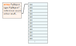

---
jupytext:
  cell_metadata_filter: -all
  formats: md:myst
  text_representation:
    extension: .md
    format_name: myst
    format_version: 0.13
    jupytext_version: 1.16.6
kernelspec:
  display_name: Python 3 (ipykernel)
  language: python
  name: python3
---

# Lesson 2: Array-oriented programming

+++

Programming paradigms, such as "imperative", "object-oriented", and "functional", are general _styles_ of programming. Some programming languages favor one over the others, or make it easier to use one, rather than the others. For instance, C++ enables object-oriented programming in C.

In array-oriented programming, the primary data type is an array and most functions perform one operation on all values of the array.

+++

## Simple example of imperative, functional, and array-oriented

+++

Below are three solutions to the following problem: compute the square of each value in a collection of numbers.

+++

### Imperative

+++

Imperative programming is likely to be the most familiar: you supply a sequence of commands and the computer follows them one by one.

```{code-cell} ipython3
original = [1, 2, 3, 4, 5, 6, 7, 8, 9, 10]

result = []
for x in original:
    result.append(x**2)

result
```

### Functional

+++

Functional programming takes seriously the idea that functions are objects that can be passed around like any other data. Functional programming environments have a suite of predefined functions-that-take-functions such as `map` (apply a given function to every member of a collection, returning a collection), `filter` (use a boolean function to determine which values to keep), and `reduce` (apply a function to pairs of values in the collection to return a scalar).

In the following, Python's `lambda` keyword defines a function as an expression without assigning it to a variable name (as `def` does).

```{code-cell} ipython3
original = [1, 2, 3, 4, 5, 6, 7, 8, 9, 10]

result = list(map(lambda x: x**2, original))

result
```

Python is not very friendly toward functional programming, since many of its functions (like `list.append`) change data in ways other than through the return value, and because the syntax for creating a lambda function is so long. (Compare `lambda x: x**2` in Python with `\x -> x**2` in Haskell.)

In Python, we often use list comprehensions where we would otherwise use `map` and `filter`.

```{code-cell} ipython3
original = [1, 2, 3, 4, 5, 6, 7, 8, 9, 10]

result = [x**2 for x in original]

result
```

### Array-oriented

+++

Array-oriented programming is a little different from functional programming: instead of writing (lambda) functions and passing them to explicit calls of `map`, `filter`, and `reduce`, you use precompiled functions implicitly when you write expressions involving arrays.

```{code-cell} ipython3
import numpy as np
```

```{code-cell} ipython3
original = np.array([1, 2, 3, 4, 5, 6, 7, 8, 9, 10])

result = original**2

result
```

This formalism has the property that any mathematical expression on scalar numbers can also be applied to equal-length arrays of numbers. For example,

```{code-cell} ipython3
def quadratic_formula(a, b, c):
    return (-b + np.sqrt(b**2 - 4*a*c)) / (2*a)
```

computes the (positive) quadratic formula

$$ \frac{-b + \sqrt{b^2 - 4ac}}{2a} $$

once if `a`, `b`, and `c` are scalar numbers,

```{code-cell} ipython3
a = 5
b = 10
c = -0.1

quadratic_formula(a, b, c)
```

or a million times if they are arrays of length 1 million.

```{code-cell} ipython3
a = np.random.uniform(5, 10, 1000000)
b = np.random.uniform(10, 20, 1000000)
c = np.random.uniform(-0.1, 0.1, 1000000)

quadratic_formula(a, b, c)
```

## Complex example of imperative, functional, and array-oriented

+++

With a simple example, it's easy to see exactly what it's doing, but it doesn't convey the "flavor" of how these paradigms differ in practice.

Here is a complex example. You don't have to understand the details of how each solution works—just see how they follow different approaches and how the code generally looks. The problem is to compute gravitational forces among $n$ particles in 3 dimensions.

+++

### Imperative

```{code-cell} ipython3
def imperative_forces(m, x, p):
    total_force = np.zeros_like(x)

    for i in range(len(x)):
        for j in range(i + 1, len(x)):
            mi, mj = m[i], m[j]
            xi, xj = x[i], x[j]
            pi, pj = p[i], p[j]
            displacement = [
                xj[0] - xi[0],
                xj[1] - xi[1],
                xj[2] - xi[2],
            ]
            distance = np.sqrt(displacement[0]**2 + displacement[1]**2 + displacement[2]**2)
            direction = [
                displacement[0] / distance,
                displacement[1] / distance,
                displacement[2] / distance,
            ]
            force = [
                G * mi * mj * direction[0] / distance**2,
                G * mi * mj * direction[1] / distance**2,
                G * mi * mj * direction[2] / distance**2,
            ]
            total_force[i, 0] += force[0]
            total_force[i, 1] += force[1]
            total_force[i, 2] += force[2]
            total_force[j, 0] += -force[0]
            total_force[j, 1] += -force[1]
            total_force[j, 2] += -force[2]

    return total_force
```

The imperative solution is a long sequence of commands in nested `for` loops.

+++

### Functional

```{code-cell} ipython3
from functools import reduce
from itertools import combinations
```

```{code-cell} ipython3
def functional_forces(m, x, p):
    def negate(vector):
        return [-a for a in vector]

    def add(*vectors):
        return [reduce(lambda a, b: a + b, components) for components in zip(*vectors)]

    def subtract(vectorA, vectorB):
        return add(vectorA, negate(vectorB))

    def magnitude(vector):
        return np.sqrt(reduce(lambda a, b: a + b, map(lambda a: a**2, vector)))

    def force(mi, mj, xi, xj, pi, pj):
        displacement = subtract(xi, xj)
        distance = magnitude(displacement)
        direction = [a / distance for a in displacement]
        return [G * mi * mj * a / distance**2 for a in direction]

    pairwise_forces = [
        ((i, j), force(mi, mj, xi, xj, pi, pj))
        for ((i, (mi, xi, pi)), (j, (mj, xj, pj))) in combinations(enumerate(zip(m, x, p)), 2)
    ]

    def partial_forces(pairwise_forces, i):
        return (
            [force for (_, check), force in pairwise_forces if i == check] +
            [negate(force) for (check, _), force in pairwise_forces if i == check]
        )

    return np.array([add(*partial_forces(pairwise_forces, i)) for i in range(len(m))])
```

The functional solution defines many small functions and applies them in two list comprehensions.

+++

### Array-oriented

```{code-cell} ipython3
def array_forces(m, x, p):
    i, j = np.triu_indices(len(x), k=1)
    pw_displacement = x[j] - x[i]
    pw_distance = np.sqrt(np.sum(pw_displacement**2, axis=-1))
    pw_direction = pw_displacement / pw_distance[:, np.newaxis]
    pw_force = G * m[i, np.newaxis] * m[j, np.newaxis] * pw_direction / pw_distance[:, np.newaxis]**2
    total_force = np.zeros_like(x)
    np.add.at(total_force, i, pw_force)
    np.add.at(total_force, j, -pw_force)
    return total_force
```

The array-oriented solution is very concise—maybe even "dense"—and it invovles special NumPy functions such as [np.triu_indices](https://numpy.org/doc/stable/reference/generated/numpy.triu_indices.html) for the $n (n - 1) / 2$ combinatorics and [advanced slicing](https://numpy.org/doc/stable/user/basics.indexing.html#advanced-indexing) in square brackets (`[` `]`).

+++

### Comparison of the three solutions

+++

First, let's just verify that they give the same result in a numerical example.

```{code-cell} ipython3
# three masses
m = np.array([2, 10, 1.1])

# initial position (x) and momentum (p) for each of the three
x = np.array([[0.1, 0.1, 0], [2, 0.9, 0.1], [-5, 1.5, -0.1]])
p = np.array([[3, -1, 0.5], [-13, 0, -0.2], [-10, 0.1, 0]])

G = 1
```

```{code-cell} ipython3
imperative_test = imperative_forces(m, x, p)
imperative_test
```

```{code-cell} ipython3
functional_test = functional_forces(m, x, p)
functional_test
```

```{code-cell} ipython3
array_test = array_forces(m, x, p)
array_test
```

```{code-cell} ipython3
np.allclose(imperative_test, functional_test)
```

```{code-cell} ipython3
np.allclose(functional_test, array_test)
```

(It could be more carefully tested at more points.)

Now compare the time to compute a sample of 500 planets.

```{code-cell} ipython3
m = np.ones(500)
x = np.random.normal(0, 1, (500, 3))
p = np.random.normal(0, 1, (500, 3))
```

```{code-cell} ipython3
%%timeit -n1 -r1

imperative_forces(m, x, p)
```

```{code-cell} ipython3
%%timeit -n1 -r1

functional_forces(m, x, p)
```

```{code-cell} ipython3
%%timeit -n1 -r1

array_forces(m, x, p)
```

Note the units: array-oriented is 30× faster than imperative and 300× faster than functional.

There are good reasons for this, which we'll examine in the next section.

For now, though, which one would you choose if you wanted to calculate forces repeatedly, to make animations of planetary orbits?

```{code-cell} ipython3
import matplotlib.pyplot as plt
from matplotlib import animation
from IPython.display import HTML
```

```{code-cell} ipython3
def array_step(m, x, p, dt):
    # this is a numerically stable way of updating positions, momenta, and forces
    p += array_forces(m, x, p) * (dt/2)    # half kick
    x += p * dt / m[:, np.newaxis]         # full drift
    p += array_forces(m, x, p) * (dt/2)    # half kick
```

```{code-cell} ipython3
def plot(m, x, p, dt, num_frames=100, steps_per_frame=10):
    num_particles = len(m)

    history = np.empty((num_frames, num_particles, 2))
    for i in range(num_frames):
        history[i, :, 0] = x[:, 0]
        history[i, :, 1] = x[:, 1]
        for _ in range(steps_per_frame):
            array_step(m, x, p, dt)

    fig, ax = plt.subplots(figsize=(5, 5))

    lines = []
    for j in range(num_particles):
        lines.append(ax.plot(history[:1, j, 0], history[:1, j, 1])[0])
    dots = ax.scatter(history[0, :, 0], history[0, :, 1])

    ax.set_xlim(-2, 2)
    ax.set_ylim(-2, 2)

    def update(i):
        for j, line in enumerate(lines):
            line.set_xdata(history[:i, j, 0])
            line.set_ydata(history[:i, j, 1])
        dots.set_offsets(history[i, :, :])
        return [*lines, dots]

    ani = animation.FuncAnimation(fig=fig, func=update, frames=num_frames, interval=50, blit=True)
    out = HTML(ani.to_jshtml())
    plt.close()
    return out
```

Double-planet orbits a star:

```{code-cell} ipython3
m = np.array([100, 1, 1], np.float64)
x = np.array([[0, 0, 0], [0, 0.9, 0], [0, 1.1, 0]], np.float64)
p = np.array([[0, 0, 0], [-13, 0, 0], [-10, 0, 0]], np.float64)

plot(m, x, p, dt=0.001)
```

Solution to the three-body problem!

```{code-cell} ipython3
a = 0.347111
b = 0.532728
m = np.array([1, 1, 1], np.float64)
x = np.array([[-1, 0, 0], [1, 0, 0], [0, 0, 0]], np.float64)
p = np.array([[a, b, 0], [a, b, 0], [-2 * a, -2 * b, 0]], np.float64)

plot(m, x, p, dt=0.01)
```

Chaos!

```{code-cell} ipython3
m = np.ones(25)
x = np.random.normal(0, 1, (25, 3))
p = np.random.normal(0, 1, (25, 3))

plot(m, x, p, dt=0.0025)
```

## Why is array-oriented programming fast?

+++

A better question is, "Why is Python code slow?"

Roughly speaking, there are two types of languages—the "compile-first" ones, which are fast, and interactive ones, which are slow. This plot shows execution times for 10 scientific problems implemented in 12 languages ([Debian Benchmarks Game](https://benchmarksgame-team.pages.debian.net/benchmarksgame/)).

{. width="100%"}

Python, Ruby, Perl, Lua, and PHP all have the following in common:

* they run instructions on an emulated virtual machine, rather than the physical computer,
* they are dynamically typed, checking the types of each function call immediately before execution, rather than once in a compilation phase,
* they all do many other dynamic, high-level things, like using garbage collectors, representing all values as objects, managing their own heap of memory, etc.

Thus, there's a speed penalty for every line of Python code that is much larger than an equivalent line of compiled code.

However, a single NumPy function call that performs a million numerical calculations avoids Python's speed trap without giving up on interactivity. In the gravitational force calculation on 500 planets (above),

* `imperative_forces` makes Python loop over 500 × 499 pairs of planets, and on each pair it steps through 25 lines of Python code (214 virtual machine instructions),
* `functional_forces` has a Python list comprehension over 500 × 499 pairs of planets, each of which calls 6 functions with a total of 12 lines of Python code (100 virtual machine instructions), plus all of the function call-stack overhead,
* `array_forces` steps through 9 lines of Python code (103 virtual machine instructions) _once_. The loop over 500 × 499 pairs of planets is in compiled code, not Python code.

Here is a similar argument for the simple problem of squaring numbers:

```{code-cell} ipython3
original = np.random.poisson(3.14, 1000000)
```

```{code-cell} ipython3
def imperative_squares(original):
    result = []
    for x in original:
        result.append(x**2)
    return result
```

```{code-cell} ipython3
%%timeit

imperative_squares(original)
```

```{code-cell} ipython3
import dis  # dissasembler; shows us the Python virtual machine instructions
```

```{code-cell} ipython3
dis.dis(imperative_squares)
```

It steps from `FOR_ITER` to `JUMP_BACKWARD` a million times and has to verify that `x` is an integer every time it gets to `BINARY_OP`.

On the other hand, in the array-oriented solution:

```{code-cell} ipython3
def array_squares(original):
    return original**2
```

```{code-cell} ipython3
%%timeit

array_squares(original)
```

```{code-cell} ipython3
dis.dis(array_squares)
```

It steps through the above once and runs NumPy's compiled code when it gets to `BINARY_OP`. It checks array types once so that it can assume that the numeric types are correct in the loop over a million integers. The physical CPU applies even more optimizations (memory prefetching, instruction pipelining, and maybe vector instructions).

+++

## Why does it use less memory?

+++

Arrays also use less memory than Python lists.

```{code-cell} ipython3
from pympler.tracker import SummaryTracker
```

```{code-cell} ipython3
memory_tracker = SummaryTracker()
memory_tracker.diff()

list_of_numbers = list(range(1000000))
array_of_numbers = np.arange(1000000)

memory_tracker.print_diff()

del list_of_numbers, array_of_numbers
```

The base list and NumPy array are both 7.63 MB, but Python also requires 26.70 MB for 999743 integers.

Naively, 1000000 × 8-byte integers should be

```{code-cell} ipython3
1000000 * 8 / 1024**2
```

MB. So what does Python need the extra 26.70 MB for?

Here's the memory layout of a Python list of numbers:

{. width="75%"}

and here's the memory layout of a NumPy array of numbers:

{. width="75%"}

So if you're dealing with large datasets in Python, putting them in arrays is a good idea!

+++

## Expressiveness of array-oriented programming

+++

The performance advantages of array-oriented programming would not be useful if it were hard to express what you need to calculate. Unlike functional programming, you cannot write a function to `map` it over a dataset: you have to piece together the calculation you want to perform using the precompiled functions NumPy provides.

As an indication of what array-oriented programming is good for, here's a timeline of _all_ the array-oriented programming languages and libraries (that I know about):

{. width="100%"}

All of them are _interactive, data analysis_ environments. They all feature

* an interactive REPL (read-evaluate-print loop),
* concise notation,
* a mathematical outlook.

This paradigm started mathematical and concise (perhaps too much): in the original language, [APL](https://tryapl.org/),

```{code-cell} ipython3
np.arange(10)
```

was

```apl
(⍳10) - 1
```

```{code-cell} ipython3
np.sum(np.arange(1, 11))
```

was

```apl
+/⍳10
```

and

```{code-cell} ipython3
np.cumsum(np.arange(1, 11))
```

was

```apl
+\⍳10
```

It had a special keyboard for mathematical symbols and writing a one-line program was hard enough to celebrate by printing it on a T-shirt.

{. width="20%"}

Modern array-oriented environments like NumPy are a step back, away from extreme conciseness.

+++

## Example of an array-oriented conversation

+++

A programming paradigm brings some concepts into the foreground and pushes others into the background:

| paradigm | emphasizes |
|:-:|:-:|
| imperative/procedural | low-level algorithms |
| object-oriented | large-scale program structure |
| actor-based | temporal locality |
| literate | human instruction |
| event-driven | cause-and-effect |
| declarative | properties of desired result |
| symbolic | formula transformations |
| functional | data transformations |
| array-oriented | data distributions |

Array-oriented programming emphasizes data distributions. Each precompiled step, which you can't step through to examine or debug, iterates over all values in an array. Each interactive step lets you decide what will be the next operation you want to perform. It's one mathematical operation at a time, rather than one data point at a time.

Suppose that you have a large dataset.

```{code-cell} ipython3
dataset = np.random.normal(0, 1, 1000000)  # one MILLION data points
```

You're not very interested in the first, or second, or third value in the dataset. You're interested in their distribution, so you plot it.

```{code-cell} ipython3
plt.hist(dataset, bins=100, range=(-5, 5));
```

It's a Gaussian (normal) distribution.

What happens if we square all values in the dataset?

```{code-cell} ipython3
dataset2 = dataset**2

plt.hist(dataset2, bins=100, range=(-5, 5));
```

Okay, what if we compute this function?

```{code-cell} ipython3
dataset3 = np.sin(1/dataset2)
```

What happens to the distribution? Can you guess? (I can't.)

```{code-cell} ipython3
plt.hist(dataset3, bins=100, range=(-1, 1));
```

In a data analysis, you'll be investigating some effect, such as a source of systematics. You'll apply a cut and look at the result—maybe that makes things better. You'll try to apply a transformation to narrow in on the effect—maybe that makes things worse, so you back up to what you had previously. Then you apply it step by step and discover your error on one of the steps. Then you put the whole expression together again and move on.

This combination of interactivity between operations and high-performance in operations over a whole dataset is a perfect fit for investigative data analysis.

+++

## NumPy features

+++

{. width="100%"}

The main features you'll likely use from NumPy are:

* reading and creating arrays,
* elementwise arithmetic operations (`+` `-` `*` `/`, etc.) and comparisons (`==` `!=` `<` `<=` `>` `>=`),
* universal functions ([ufunc](https://numpy.org/doc/stable/reference/ufuncs.html)), which are precompiled elementwise functions like `sqrt`, `sin`, `cos`,
* slicing in ranges (like Python lists), in multiple dimensions, and [advanced slicing](https://numpy.org/doc/stable/user/basics.indexing.html#advanced-indexing) with arrays of booleans and integers,
* reductions, such as [sum](https://numpy.org/doc/stable/reference/generated/numpy.sum.html), [min](https://numpy.org/doc/stable/reference/generated/numpy.min.html)/[max](https://numpy.org/doc/stable/reference/generated/numpy.max.html), [mean](https://numpy.org/doc/stable/reference/generated/numpy.mean.html) over an axis or over everything,
* [sorting](https://numpy.org/doc/stable/reference/generated/numpy.sort.html), [concatenation](https://numpy.org/doc/stable/reference/generated/numpy.concatenate.html), [linear algebra](https://numpy.org/doc/stable/reference/routines.linalg.html), ...

For most of these, the documentation is the best source. Here, let's focus on slicing and reductions.

+++

### Slicing

+++

Python's slicing syntax, which works on containers like `list` and `tuple`, is

```python
container[start:stop:step]
```

* If `start` or `stop` is non-negative, it counts from the beginning of the container with `0` as the first item.
* If `start` or `stop` is negative, it counts from the end of the container with `-1` as the first item.
* The `step` indicates how many items between each step: `1` is normal, `2` skips every other item, `-1` goes backward, and `0` is not allowed.
* Any of the three can be left out to get a reasonable default.

```{code-cell} ipython3
container = [0.0, 1.1, 2.2, 3.3, 4.4, 5.5, 6.6, 7.7, 8.8, 9.9]
```

```{code-cell} ipython3
container[2:]
```

```{code-cell} ipython3
container[:5]
```

```{code-cell} ipython3
container[-6:-2]
```

```{code-cell} ipython3
container[4:10:2]
```

```{code-cell} ipython3
container[::3]
```

NumPy arrays can be sliced like this, but they can also include a comma (`,`) to slice over multiple dimensions.

{. width="50%"}

```{code-cell} ipython3
arr = np.array([[1.1, 2.2, 3.3],
                [4.4, 5.5, 6.6],
                [7.7, 8.8, 9.9]])
arr
```

```{code-cell} ipython3
arr[:2, 1:]
```

```{code-cell} ipython3
arr[2:, :]
```

```{code-cell} ipython3
arr[:, :2]
```

```{code-cell} ipython3
arr[1:2, :2]
```

**Mini-quiz 1:** Given this 3D array,

```{code-cell} ipython3
array3d = np.arange(2 * 3 * 5).reshape(2, 3, 5)
array3d
```

you can select items

{. width="25%"}

with

```{code-cell} ipython3
array3d[:, 1:, 1:]
```

Write a slice that selects these elements:

{. width="25%"}

+++

**Mini-quiz 2:** Use slicing and elementwise subtraction (`-`) together to find the sizes of the spaces between consecutive elements in the following array. (They're all `1.1`.)

```{code-cell} ipython3
array = np.array([1.1, 2.2, 3.3, 4.4, 5.5, 6.6, 7.7, 8.8, 9.9])
array
```

Hint:

{. width="100%"}

+++

### Advanced slicing

+++

In addition, NumPy can slice arrays with arrays. If the array in square brackets (`[` `]`) has boolean values, it must have the same length (shape) as the array to slice and items that line up with `True` are kept; items that line up with `False` are dropped.

```{code-cell} ipython3
arr  = np.array([  0.0,   1.1,   2.2,   3.3,   4.4,  5.5,   6.6,  7.7,   8.8,  9.9])
mask = np.array([False, False, False, False, False, True, False, True, False, True])
#                                                    5.5          7.7          9.9
```

```{code-cell} ipython3
arr[mask]
```

In particle physics, this is usually used to select events, as a cut.

```{code-cell} ipython3
cut = arr > 3
cut
```

```{code-cell} ipython3
arr[cut]
```

If the array in square brackets (`[` `]`) has integer values, it picks out elements by index.

```{code-cell} ipython3
arr[np.array([5, 7, -1])]
```

Unlike boolean-masking, the items to select can be out of order.

```{code-cell} ipython3
arr[np.array([-1, 7, 5])]
```

And they can also include duplicates.

```{code-cell} ipython3
arr[np.array([-1, -1, -1, 7, 7, 5])]
```

Integer array slicing is the most general kind of slicing: if you think of an array as a function from index position (integers) to values, integer array slicing is function composition. Consider this example of text vectorization:

```{code-cell} ipython3
text = """
WOULD YOU LIKE GREEN EGGS AND HAM?

I DO NOT LIKE THEM, SAM-I-AM.
I DO NOT LIKE GREEN EGGS AND HAM.

WOULD YOU LIKE THEM HERE OR THERE?

I WOULD NOT LIKE THEM HERE OR THERE.
I WOULD NOT LIKE THEM ANYWHERE.
I DO NOT LIKE GREEN EGGS AND HAM.
I DO NOT LIKE THEM, SAM-I-AM.

WOULD YOU LIKE THEM IN A HOUSE?
WOULD YOU LIKE THEN WITH A MOUSE?

I DO NOT LIKE THEM IN A HOUSE.
I DO NOT LIKE THEM WITH A MOUSE.
I DO NOT LIKE THEM HERE OR THERE.
I DO NOT LIKE THEM ANYWHERE.
I DO NOT LIKE GREEN EGGS AND HAM.
I DO NOT LIKE THEM, SAM-I-AM.

WOULD YOU EAT THEM IN A BOX?
WOULD YOU EAT THEM WITH A FOX?

NOT IN A BOX. NOT WITH A FOX.
NOT IN A HOUSE. NOT WITH A MOUSE.
I WOULD NOT EAT THEM HERE OR THERE.
I WOULD NOT EAT THEM ANYWHERE.
I WOULD NOT EAT GREEN EGGS AND HAM.
I DO NOT LIKE THEM, SAM-I-AM.
"""
```

```{code-cell} ipython3
# remove punctuation and make an array of words
words = np.array(text.replace(",", " ").replace(".", " ").replace("?", " ").replace("!", " ").replace("-", " ").split())

# find the unique words and get an index of where they are in the corpus
dictionary, index = np.unique(words, return_inverse=True)
```

```{code-cell} ipython3
dictionary
```

```{code-cell} ipython3
index
```

The `index` is a vector encoding the text corpus. The first few words are

```{code-cell} ipython3
dictionary[index[0]]
```

```{code-cell} ipython3
dictionary[index[1]]
```

```{code-cell} ipython3
dictionary[index[2]]
```

and the whole text is

```{code-cell} ipython3
dictionary[index]
```

### Reductions

+++

Reductions are operations that reduce the number of dimensions in an array.

```{code-cell} ipython3
arr = np.array([[  1,   2,   3,   4],
                [ 10,  20,  30,  40],
                [100, 200, 300, 400]])
```

In a sense, scalar-integer slicing is a reduction:

```{code-cell} ipython3
arr[2, :]
```

```{code-cell} ipython3
arr[:, 3]
```

A scalar is a zero-dimensional array, so this is also reduction:

```{code-cell} ipython3
arr[2, 3]
```

But it's more common to refer to operations like [sum](https://numpy.org/doc/stable/reference/generated/numpy.sum.html), [min](https://numpy.org/doc/stable/reference/generated/numpy.min.html)/[max](https://numpy.org/doc/stable/reference/generated/numpy.max.html), and [mean](https://numpy.org/doc/stable/reference/generated/numpy.mean.html) as reductions.

By default, they reduce to a scalar.

```{code-cell} ipython3
np.sum(arr)
```

```{code-cell} ipython3
np.max(arr)
```

But they can also reduce along one of the dimensions.

{. width="50%"}

```{code-cell} ipython3
np.sum(arr, axis=0)
```

```{code-cell} ipython3
np.sum(arr, axis=1)
```

**Mini-quiz 3:** Using slicing, elementwise operations, and a reducer, find the length of this curve.

{. width="50%"}

```{code-cell} ipython3
t = np.linspace(0, 2*np.pi, 10000)
x = np.sin(3*t)
y = np.sin(4*t)
```

```{code-cell} ipython3
plt.plot(x, y);
```

## Lesson 2 project: Higgs decay combinatorics

+++

As described in the [intro](0-intro.md), navigate to the `notebooks` directory and open `lesson-2-project.ipynb`, then follow its instructions.
