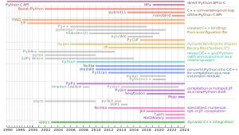

---
jupytext:
  cell_metadata_filter: -all
  formats: md:myst
  text_representation:
    extension: .md
    format_name: myst
    format_version: 0.13
    jupytext_version: 1.16.6
kernelspec:
  display_name: Python 3 (ipykernel)
  language: python
  name: python3
---

# Lesson 4: Vertical and horizontal scaling

+++

This lesson is about making Python faster, in two dimensions: "vertical" scaling means accelerating a workload by improving its efficiency and "horizontal" scaling means accelerating a workload by running it on more processors.

{. width="60%"}

We'll start with vertical scaling.

+++

## Performance limitations of array-oriented code

+++

As a reminder, Python is slow for reasons that have to do with the interactive, dynamic environment that it provides. "Compile-first" languages that focus on speed are usually orders of magnitude faster than Python for equivalent code.

We've also seen that array-oriented computing can accelerate Python by offloading number-crunching to compiled code.

```{code-cell} ipython3
import numpy as np
import awkward as ak
```

```{code-cell} ipython3
events = ak.from_parquet("data/SMHiggsToZZTo4L.parquet")[:100000]
```

The following makes an array of lists of muon $p_z = p_T \sinh(\eta)$ using (nested) list comprehensions and Awkward Array.

```{code-cell} ipython3
%%timeit -r1 -n1

pz = [[muon.pt * np.sinh(muon.eta) for muon in event.muon] for event in events]
```

```{code-cell} ipython3
%%timeit -r1 -n1

pz = events.muon.pt * np.sinh(events.muon.eta)
```

It's thousands of times faster. And yet, the array-oriented solution is still giving up some computational efficiency because it makes multiple loops over the data.

In general, computing is much faster than memory access. While the fastest instructions (like addition) take about 1 CPU cycle to compute, accessing RAM takes about 240 cycles ([_What every programmer should know about memory_](https://people.freebsd.org/~lstewart/articles/cpumemory.pdf), Ulrich Drepper (2007)). To prevent this difference in speed from starving the CPU, data streams from RAM into the CPU through a hierarchy of caches.

{. width="75%"}

But if we stream a large array through the CPU to perform one mathematical operation, then do it again to perform another operation, the caches (which are smaller than the array) get overwritten before they can be used again.

+++

## Speed of compiled code

+++

Generally, a function written in a "compile-first" language provides a baseline: the fastest that the function can be executed. ("Generally" because it's still possible to make performance _mistakes_.)

Let's see that using C and the quadratic formula as examples. First, we have to create a file with the C function in it,

```{code-cell} ipython3
%%writefile quadratic_formula_c.c

#include <math.h>

void run(double* a, double* b, double* c, double* output) {
    for (int i = 0;  i < 1000000;  i++) {
        output[i] = (-b[i] + sqrt(b[i]*b[i] - 4*a[i]*c[i])) / (2*a[i]);
    }
}
```

then compile that file (with `-O3` for all optimizations, `-shared` to make code that can be dynamically loaded instead of a full program, and `-lm` to make the math functions work),

```{code-cell} ipython3
! cc quadratic_formula_c.c -O3 -shared -lm -o quadratic_formula_c.so
```

and then load it into Python and tell Python how to use it.

```{code-cell} ipython3
import ctypes
```

```{code-cell} ipython3
pointer_double = ctypes.POINTER(ctypes.c_double)

quadratic_formula_c = ctypes.CDLL("./quadratic_formula_c.so")
quadratic_formula_c.run.argtypes = (pointer_double, pointer_double, pointer_double, pointer_double)
quadratic_formula_c.run.restype = None

def ptr(array):
    return array.ctypes.data_as(pointer_double)
```

Now let's test it on a million values.

```{code-cell} ipython3
a = np.random.uniform(5, 10, 1000000)
b = np.random.uniform(10, 20, 1000000)
c = np.random.uniform(-0.1, 0.1, 1000000)
```

```{code-cell} ipython3
%%timeit

output = np.empty(1000000)
quadratic_formula_c.run(ptr(a), ptr(b), ptr(c), ptr(output))
```

```{code-cell} ipython3
%%timeit

output = (-b + np.sqrt(b**2 - 4*a*c)) / (2*a)
```

The corresponding formula in NumPy is about 3× slower.

Hidden in the NumPy expression are intermediate arrays: each operation creates a new array, and most of them are only needed temporarily. The above is roughly equivalent to this:

```{code-cell} ipython3
%%timeit

tmp1 = np.negative(b)            # -b
tmp2 = np.square(b)              # b**2
tmp3 = np.multiply(4, a)         # 4*a
tmp4 = np.multiply(tmp3, c)      # tmp3*c
del tmp3
tmp5 = np.subtract(tmp2, tmp4)   # tmp2 - tmp4
del tmp2, tmp4
tmp6 = np.sqrt(tmp5)             # sqrt(tmp5)
del tmp5
tmp7 = np.add(tmp1, tmp6)        # tmp1 + tmp6
del tmp1, tmp6
tmp8 = np.multiply(2, a)         # 2*a
np.divide(tmp7, tmp8)            # tmp7 / tmp8     This is the result!
```

("Roughly" because NumPy attempts to "fuse" some operations to avoid intermediate arrays, which accounts for this 30% difference in speed. But the 3× faster C function is completely "fused".)

Remember, though, that NumPy is hundreds of times faster than a Python `for` loop,

```{code-cell} ipython3
%%timeit -r1 -n1

output = np.empty(1000000)
for i in range(len(output)):
    output[i] = (-b[i] + np.sqrt(b[i]**2 - 4*a[i]*c[i])) / (2*a[i])
```

so the speed hierarchy has two steps:

$$ \mbox{Python loops} \ll \mbox{NumPy} < \mbox{compiled} $$

with a much bigger gap between Python loops and NumPy than NumPy and compiled code. A generally good strategy is to figure out how you're going to solve computational problems in Python and array-oriented code, which is more convenient because it is interactive, and then optimize the solution in compiled code when you think you're done.

+++

## Getting compiled code into Python

+++

Methods of getting compiled code into Python have been developed throughout its history. The colors refer to different _types_ of techniques.

{. width="100%"}

We've already used Python's built-in `ctypes` module, which lets us pass arrays to a compiled C function, but we have to know its types and any mistake could cause a segfault (the program would crash without giving us a prompt to figure out why) or undefined behavior (completely random errors).

+++

### pybind11

+++

The [pybind11](https://pybind11.readthedocs.io/) package provides a safer way to do it, this time using C++ instead of C. The following file defines a Python module with a `run` function.

```{code-cell} ipython3
%%writefile quadratic_formula_pybind11.cpp

#include <pybind11/pybind11.h>
#include <pybind11/numpy.h>

namespace py = pybind11;

void run(
    py::array_t<double, py::array::forcecast> a_numpy,
    py::array_t<double, py::array::forcecast> b_numpy,
    py::array_t<double, py::array::forcecast> c_numpy,
    py::array_t<double> output_numpy
) {
    const double* a = a_numpy.data();
    const double* b = b_numpy.data();
    const double* c = c_numpy.data();
    double* output = output_numpy.mutable_data();
    for (int i = 0;  i < output_numpy.size();  i++) {
        output[i] = (-b[i] + sqrt(b[i]*b[i] - 4*a[i]*c[i])) / (2*a[i]);
    }
}

PYBIND11_MODULE(quadratic_formula_pybind11, m) {
    m.def("run", &run);
}
```

The `py::array_t` type is templated to ensure that the NumPy array has `double`-valued numbers and applies a policy of forcing it to be cast if it does not. (The `output_numpy` can't be cast or the function would fill a copy, rather than the array we give it.)

The compilation procedure is more complicated, but there are helper functions in Python.

```{code-cell} ipython3
import os
import sys
from pybind11 import get_include

inc = "-I " + get_include()
plat = "-undefined dynamic_lookup" if "darwin" in sys.platform else "-fPIC"
pyinc = !python3-config --cflags
```

```{code-cell} ipython3
! c++ -std=c++11 quadratic_formula_pybind11.cpp -O3 -shared {inc} {pyinc.s} -o quadratic_formula_pybind11.so {plat}
```

Now it's a Python module that can be imported in the normal way.

```{code-cell} ipython3
import quadratic_formula_pybind11
```

```{code-cell} ipython3
output = np.zeros(1000000)
quadratic_formula_pybind11.run(a, b, c, output)
output
```

It's about the same speed as the C function,

```{code-cell} ipython3
%%timeit

output = np.zeros(1000000)
quadratic_formula_pybind11.run(a, b, c, output)
```

but much safer.

**Important!** As usual with array-oriented programming, the essential thing is that the loop over big datasets is in the compiled code. What do you think will happen in the following?

```{code-cell} ipython3
%%writefile quadratic_formula_pybind11_noloop.cpp

#include <pybind11/pybind11.h>
namespace py = pybind11;

double run(double a, double b, double c) {
    return (-b + sqrt(b*b - 4*a*c)) / (2*a);
}
PYBIND11_MODULE(quadratic_formula_pybind11_noloop, m) {
    m.def("run", &run);
}
```

```{code-cell} ipython3
! c++ -std=c++11 quadratic_formula_pybind11_noloop.cpp -O3 -shared {inc} {pyinc.s} -o quadratic_formula_pybind11_noloop.so {plat}
```

```{code-cell} ipython3
import quadratic_formula_pybind11_noloop
```

```{code-cell} ipython3
%%timeit -r1 -n1

output = np.zeros(1000000)
for i in range(len(output)):
    output[i] = quadratic_formula_pybind11_noloop.run(a[i], b[i], c[i])
```

If you want to publish an accelerated Python module, pybind11 is a good choice. However, it has two problems if you're using it interactively,

* changing the C++ code, recompiling and reloading _does not_ update the code that gets run (`import` only works once for compiled code),
* you have to use two languages: Python and C++.

+++

### Numba

+++

The [Numba](https://numba.pydata.org/) package lets you compile and recompile functions that are written in (a subset of) Python.

```{code-cell} ipython3
import numba as nb
```

```{code-cell} ipython3
@nb.jit
def quadratic_formula_numba(a_array, b_array, c_array):
    output = np.empty(len(a_array))
    for i, (a, b, c) in enumerate(zip(a_array, b_array, c_array)):
        output[i] = (-b + np.sqrt(b**2 - 4*a*c)) / (2*a)
    return output
```

Numba compiles the function the first time it is called, since it compiles a different version of the function for each combination of data types.

```{code-cell} ipython3
quadratic_formula_numba(a, b, c)
```

```{code-cell} ipython3
%%timeit

quadratic_formula_numba(a, b, c)
```

The catch is that some code that works in Python,

```{code-cell} ipython3
def f():
    x = "a string"
    for i in range(5):
        if i == 0:
            x = 0
        x = x + 1
    return x

f()
```

does not work in Numba.

```{code-cell} ipython3
@nb.jit
def f():
    x = "a string"
    for i in range(5):
        if i == 0:
            x = 0
        x = x + 1
    return x

numba_error = None
try:
    f()
except Exception as err:
    numba_error = err

print(numba_error)
```

In the case above, it's because `x = x + 1` would be wrong for `x = "a string"` and the compiler doesn't recognize that `x` will always be an integer before it gets to that line. It can't _prove_ (mathematically) that the error never happens, so it can't generate compiled code, which doesn't check such things (which is what makes it fast).

Numba also can't accept data types in compiled code that it does not recognize, because it wouldn't know what compiled code to replace it with. For our purposes (the project for this lesson), Numba does recognize NumPy, Awkward Array, and Vector. See also

* the [Python features](https://numba.readthedocs.io/en/stable/reference/pysupported.html) supported by Numba,
* the [NumPy functions](https://numba.readthedocs.io/en/stable/reference/numpysupported.html) supported by Numba.

Finally, note that Numba accelerates code written in _imperative_ form, with `for` loops, since array-oriented code would create intermediate arrays, and then it doesn't matter whether it's in a compiled block or not.

```{code-cell} ipython3
@nb.jit
def quadratic_formula_numba_on_arrays(a, b, c):
    tmp1 = np.negative(b)            # -b
    tmp2 = np.square(b)              # b**2
    tmp3 = np.multiply(4, a)         # 4*a
    tmp4 = np.multiply(tmp3, c)      # tmp3*c
    tmp5 = np.subtract(tmp2, tmp4)   # tmp2 - tmp4
    tmp6 = np.sqrt(tmp5)             # sqrt(tmp5)
    tmp7 = np.add(tmp1, tmp6)        # tmp1 + tmp6
    tmp8 = np.multiply(2, a)         # 2*a
    return np.divide(tmp7, tmp8)     # tmp7 / tmp8

quadratic_formula_numba_on_arrays(a, b, c)
```

```{code-cell} ipython3
%%timeit

quadratic_formula_numba_on_arrays(a, b, c)
```

### Julia

+++

[Julia](https://julialang.org/) is a programming language that is based entirely on the idea of interactive (Just In Time, or JIT) compilation. It is like Numba, but for an entire language, without exceptions. It combines performance-oriented features like C++ with interactive convenience like Python in one language, but it is an entirely new language.

In particle physics (especially LHC), there's a [growing movement to use Julia](https://www.juliahep.org/), but it is not as widespread as Python (at the time of this writing). In particular,

* [UnROOT.jl](https://github.com/JuliaHEP/UnROOT.jl) is a Julia implementation of ROOT I/O, like Uproot for Python.
* [ROOT.jl](https://github.com/JuliaHEP/ROOT.jl) is a wrapper of [ROOT](https://root.cern/), like PyROOT for Python.
* [AwkwardArray.jl](https://github.com/JuliaHEP/AwkwardArray.jl) lets you pass data between Julia and Python as Awkward Arrays.
* and there are [many others](https://github.com/orgs/JuliaHEP/repositories).

Check it out if you're interested!

+++

### JAX

+++

Whereas Numba and Julia (primarily) accelerate imperative code, [JAX](https://jax.readthedocs.io/) accelerates array-oriented code.

```{code-cell} ipython3
import jax
jax.config.update("jax_platform_name", "cpu")
```

```{code-cell} ipython3
@jax.jit
def quadratic_formula_jax(a, b, c):
    return (-b + jax.numpy.sqrt(b**2 - 4*a*c)) / (2*a)
```

```{code-cell} ipython3
quadratic_formula_jax(a, b, c)
```

```{code-cell} ipython3
%%timeit

quadratic_formula_jax(a, b, c)
```

JAX recognizes code that would create intermediate arrays and "fuses" them so that they don't.

```{code-cell} ipython3
@jax.jit
def quadratic_formula_jax_on_arrays(a, b, c):
    tmp1 = jax.numpy.negative(b)            # -b
    tmp2 = jax.numpy.square(b)              # b**2
    tmp3 = jax.numpy.multiply(4, a)         # 4*a
    tmp4 = jax.numpy.multiply(tmp3, c)      # tmp3*c
    tmp5 = jax.numpy.subtract(tmp2, tmp4)   # tmp2 - tmp4
    tmp6 = jax.numpy.sqrt(tmp5)             # sqrt(tmp5)
    tmp7 = jax.numpy.add(tmp1, tmp6)        # tmp1 + tmp6
    tmp8 = jax.numpy.multiply(2, a)         # 2*a
    return jax.numpy.divide(tmp7, tmp8)     # tmp7 / tmp8

quadratic_formula_jax_on_arrays(a, b, c)
```

```{code-cell} ipython3
%%timeit

quadratic_formula_jax_on_arrays(a, b, c)
```

So, in the end, choosing between imperative and array-oriented code is not strictly a question of performance.

{. width="80%"}

+++

## Horizontal scaling

+++

Now that we've looked at several ways to vertically scale your code, let's consider horizontal scaling.

If you have access to a batch queue, such as the LHC GRID, you can distribute a process by writing a Python script that takes a different subset of the data in each task. However,

* you'd have to set that up by hand,
* it only applies to "embarrassingly parallel" processes, in which the data in one computer is not needed by another.

These problems can be solved by a parallel processing framework that understands workload it is parallelizing. (This was the advancement that came with Hadoop in the Big Data movement of the early 2000's.)

+++

### Dask

+++

In Python, [Dask](https://www.dask.org/) is a popular way to scale out array-oriented computations.

```{code-cell} ipython3
import dask
```

Dask replaces "eager" Python code, which computes values as soon as it is called, with "lazy" code, which returns a description of _how_ to compute the values.

This is eager:

```{code-cell} ipython3
def increment(i):
    return i + 1

def add(a, b):
    return a + b

a, b = 1, 12
c = increment(a)
d = increment(b)
output = add(c, d)

output
```

This is lazy:

```{code-cell} ipython3
@dask.delayed
def increment(i):
    return i + 1

@dask.delayed
def add(a, b):
    return a + b

a, b = 1, 12
c = increment(a)
d = increment(b)
output = add(c, d)

output
```

The lazy `output` is a set of instructions that can be executed with

```{code-cell} ipython3
output.compute()
```

or visualized with

```{code-cell} ipython3
output.visualize()
```

This set of instructions can now be sent to a computer cluster, which can ensure that each computer works on a different subset of the data.

Dask is especially intended for array-oriented programming. It has an [array](https://docs.dask.org/en/stable/array.html) data type that can be operated on like a NumPy array. Here's a lazy example of the quadratic formula.

```{code-cell} ipython3
import dask.array as da
```

```{code-cell} ipython3
a = da.random.uniform(5, 10, 1000000)
b = da.random.uniform(10, 20, 1000000)
c = da.random.uniform(-0.1, 0.1, 1000000)

output = (-b + np.sqrt(b**2 - 4*a*c)) / (2*a)
output
```

This visualization of the `output` indicates the size, data type, and number of steps in the "instructions", the Dask graph. Here's what the graph looks like:

```{code-cell} ipython3
output.visualize()
```

Every step in the formula is represented. If we want to see how a set of Dask workers would execute this, set `optimize_graph=True`.

```{code-cell} ipython3
output.visualize(optimize_graph=True)
```

The three random arrays, `a`, `b`, `c`, can be generated separately, but they need to be on one worker to compute the quadratic formula (which ends with `truediv`).

Here is an example that you should try yourself, in the workbook, to see how the graph corresponds to a parallel process.

```{code-cell} ipython3
import time
```

```{code-cell} ipython3
@dask.delayed
def start():
    print("start")
    return 1

@dask.delayed
def concurrent(initial, i):
    print(f"begin {i}")
    time.sleep(np.random.uniform(0, 5))
    print(f"end {i}")
    return initial + i**2

@dask.delayed
def combine(partial_results):
    print("combine")
    return sum(partial_results)

initial = start()
output = combine([concurrent(initial, i) for i in range(10)])
```

The graph is shown below: a single task, `start` passes its output to 10 `concurrent` tasks, which all pass their output to `combine`.

```{code-cell} ipython3
output.visualize()
```

Here's a sample run. The `concurrent` tasks begin in a random order and they finish after a random number of seconds (in a different order), and `combine` runs last. The whole process takes much less than the total time of all tasks (2.5 seconds × 10 tasks = 25 seconds) because `concurrent` are running in parallel.

```{code-cell} ipython3
output.compute()
```

For debugging, you could run them synchronously to see the difference.

```{code-cell} ipython3
with dask.config.set(scheduler="synchronous"):
    output.compute()
```

Arrays can be processed in parallel if they have `chunks` smaller than the total size of the array. In the example below, the array has 1 million elements, but each chunk has 200 thousand elements, so there's a total of 5 chunks.

```{code-cell} ipython3
a = da.random.uniform(5, 10, 1000000, chunks=200000)
b = da.random.uniform(10, 20, 1000000, chunks=200000)
c = da.random.uniform(-0.1, 0.1, 1000000, chunks=200000)

output_array = (-b + np.sqrt(b**2 - 4*a*c)) / (2*a)
output_array
```

```{code-cell} ipython3
output_array.visualize(optimize_graph=True)
```

Thus, the following calculation can run in parallel on up to 5 processors, if the computer has at least 5 CPU cores (most do).

```{code-cell} ipython3
output_array.compute()
```

### Dask clusters

+++

The above provides an easy way to parallelize across the CPUs on a single computer, but if a dataset is large enough, you'll need a computer cluster.

{. width="75%"}

If you don't have access to an existing Dask cluster, but you have computers on a network you're allowed to run large jobs on, you can set it up with one call to

```bash
dask scheduler   # starts the scheduler
```

and as many of the following as you have CPU cores:

```bash
dask worker IP-ADDRESS-OF-SCHEDULER:8786
```

The Dask workers contact the scheduler through its network address (`IP-ADDRESS-OF-SCHEDULER`, which you need to know) on default port 8786.

I'll start these now (using Python's `subprocess`) with 3 workers, each with 1 thread for simplicity.

```{code-cell} ipython3
from subprocess import Popen, PIPE
```

```{code-cell} ipython3
scheduler = Popen(["dask-scheduler"], stdout=PIPE, stderr=PIPE, text=True)
time.sleep(0.5)

worker1 = Popen(["dask", "worker", "--nthreads", "1", "127.0.0.1:8786"], stdout=PIPE, stderr=PIPE, text=True)
worker2 = Popen(["dask", "worker", "--nthreads", "1", "127.0.0.1:8786"], stdout=PIPE, stderr=PIPE, text=True)
worker3 = Popen(["dask", "worker", "--nthreads", "1", "127.0.0.1:8786"], stdout=PIPE, stderr=PIPE, text=True)
time.sleep(0.5)
```

Once these are running, we can connect to it through the scheduler's network address.

```{code-cell} ipython3
import dask.distributed
```

```{code-cell} ipython3
client = dask.distributed.Client("127.0.0.1:8786")
client
```

When you run a Dask job now, it will go from the client to the scheduler, and from there to the workers.

```{code-cell} ipython3
output.compute()
```

Now that the job is done, let's look at the server logs.

```{code-cell} ipython3
time.sleep(0.5)
worker1.terminate()
worker2.terminate()
worker3.terminate()

time.sleep(0.5)
scheduler.terminate()
```

The scheduler (hopefully!) says that it was contacted by 3 workers, received work from a client, and distributed it to the workers.

```{code-cell} ipython3
stdout, stderr = scheduler.communicate()
print(stderr)
```

The worker logs are similar: they received work and did it.

```{code-cell} ipython3
stdout1, stderr1 = worker1.communicate()
stdout2, stderr2 = worker2.communicate()
stdout3, stderr3 = worker3.communicate()
```

```{code-cell} ipython3
print(stderr1)
```

More interesting, though, is that each took on a different set of `concurrent` tasks.

```{code-cell} ipython3
print(stdout1)
```

```{code-cell} ipython3
print(stdout2)
```

```{code-cell} ipython3
print(stdout3)
```

### Dask collections

+++

Although you can build general computations with `@dask.delayed`, you would have to describe how to parallelize the work as a graph, as we did with the `concurrent` tasks above.

Dask collection types, like [array](https://docs.dask.org/en/stable/array.html), know how to parallelize over a chunked dataset (also called "partitions").

```{code-cell} ipython3
import h5py
from hist import Hist
```

This calculation of Z boson mass is distributed over (at most) 4 CPU cores.

```{code-cell} ipython3
dataset_hdf5 = h5py.File("data/SMHiggsToZZTo4L.h5")

pt1 = da.from_array(dataset_hdf5["ee_mumu"]["e1"]["pt"], chunks=10000)
phi1 = da.from_array(dataset_hdf5["ee_mumu"]["e1"]["phi"], chunks=10000)
eta1 = da.from_array(dataset_hdf5["ee_mumu"]["e1"]["eta"], chunks=10000)
pt2 = da.from_array(dataset_hdf5["ee_mumu"]["e2"]["pt"], chunks=10000)
phi2 = da.from_array(dataset_hdf5["ee_mumu"]["e2"]["phi"], chunks=10000)
eta2 = da.from_array(dataset_hdf5["ee_mumu"]["e2"]["eta"], chunks=10000)
```

```{code-cell} ipython3
mass = np.sqrt(2*pt1*pt2*(np.cosh(eta1 - eta2) - np.cos(phi1 - phi2)))
mass
```

```{code-cell} ipython3
with dask.config.set(scheduler="threads"):
    Hist.new.Reg(120, 0, 120, name="dimuon mass").Double().fill(
        mass.compute()
    ).plot();
```

The general flow is that Dask collections are used to make graphs, which get submitted to clusters to run.

{. width="100%"}

In addition to the collection types listed above, there is a [dask-awkward](https://github.com/dask-contrib/dask-awkward) package for lazy Awkward Arrays. [uproot.dask](https://uproot.readthedocs.io/en/latest/uproot._dask.dask.html) opens ROOT files lazily, either producing Dask arrays (`library="np"`) or dask-awkward arrays (`library="ak"`).

```{code-cell} ipython3
import uproot
import awkward as ak
```

```{code-cell} ipython3
events = uproot.dask("data/SMHiggsToZZTo4L.root")
events
```

```{code-cell} ipython3
selected = events[ak.num(events.Electron_pt) == 2]

pt1 = selected.Electron_pt[:, 0]
phi1 = selected.Electron_phi[:, 0]
eta1 = selected.Electron_eta[:, 0]
pt2 = selected.Electron_pt[:, 1]
phi2 = selected.Electron_phi[:, 1]
eta2 = selected.Electron_eta[:, 1]

mass = np.sqrt(2*pt1*pt2*(np.cosh(eta1 - eta2) - np.cos(phi1 - phi2)))
mass
```

```{code-cell} ipython3
with dask.config.set(scheduler="threads"):
    Hist.new.Reg(120, 0, 120, name="dimuon mass").Double().fill(
        mass.compute()
    ).plot();
```

## Lesson 4 project: JIT-compiled Higgs combinatorics

+++

As described in the [intro](0-intro.md), navigate to the `notebooks` directory and open `lesson-4-project.ipynb`, then follow its instructions.
